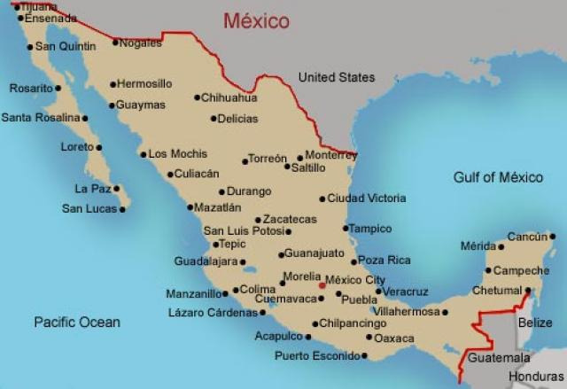

# Trip-planner--A-Star
A basic program that finds the best route between two points in a graph
Given the map below and some arbitrary roads

This program finds the optimal route between two cities.
The program works using A star
The graph is defined by a list of list, each list represents a node, the first element of the node is the name of the node, the second is its geographic coordinates and the last element is a list of cities with which it is conected and the distance in km.

((Tijuana	(32.5027 -117.00371) ((Ensenada 106) (SanQuintin 288)))
  (Ensenada (31.86613 -116.59972) ((Tijuana 106) (Rosarito 87.8)))
  (SanQuintin	(30.4833 -115.95) ((Tijuana 288) (SantaRosalina 636)))
  (Rosarito	(30.4833 -115.3667) ((Ensenada 87.8) (SantaRosalina 901) (Loreto 1097)))
  (SantaRosalina	(27.34045 -112.26761) ((SanQuintin 636) (Rosarito 901) (Loreto 197)))
  (Loreto	(22.27248 -101.98898) ((Rosarito 1097) (SantaRosalina 197) (LaPaz 356)))
  (LaPaz	(24.1164329 -110.337743) ((Loreto 356) (SanLucas 158)))
  (SanLucas	(22.8962225 -109.968017) ((LaPaz 158)))))
